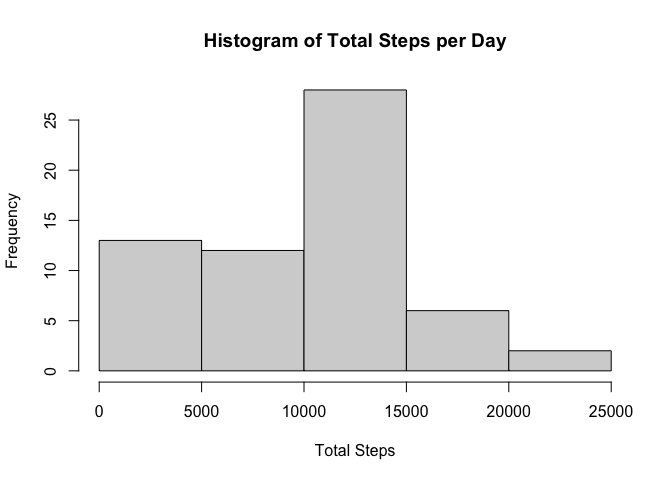
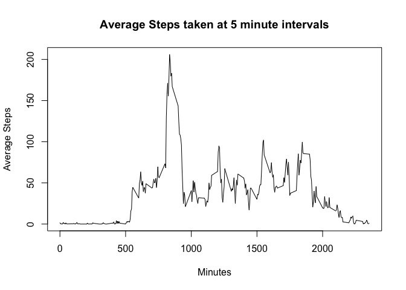
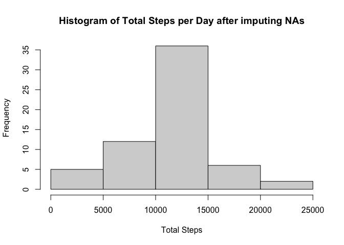
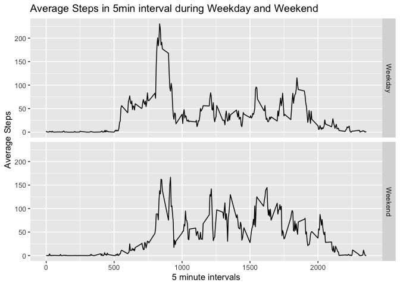

## Loading and preprocessing the data
1. Unzip data file using unzip()


```r
unzip("activity.zip")
```

2. Read .csv file

```r
data <- read.csv("activity.csv", colClasses = c("integer","Date","integer"))
```


## What is mean total number of steps taken per day?

```r
library(dplyr)
```

```
## 
## Attaching package: 'dplyr'
```

```
## The following objects are masked from 'package:stats':
## 
##     filter, lag
```

```
## The following objects are masked from 'package:base':
## 
##     intersect, setdiff, setequal, union
```

```r
mean_steps_per_day <- data %>%
        group_by(date) %>%
        summarize(Total_Steps = sum(steps, na.rm = TRUE)) 

hist(mean_steps_per_day$Total_Steps, main = "Histogram of Total Steps per Day", xlab = "Total Steps")
```

<!-- -->

```r
mean_total_steps_per_day = mean(mean_steps_per_day$Total_Steps, na.rm=TRUE)
median_total_steps_per_day = median(mean_steps_per_day$Total_Steps, na.rm=TRUE)

paste("The mean and median total steps per day are", round(mean_total_steps_per_day,0),"and",median_total_steps_per_day, "respectively.")
```

```
## [1] "The mean and median total steps per day are 9354 and 10395 respectively."
```


## What is the average daily activity pattern?

```r
daily_pattern <- data %>%
        group_by(interval) %>%
        summarise(average_steps = mean(steps, na.rm = TRUE))
plot(daily_pattern$interval, daily_pattern$average_steps, type = 'l',
     main = "Average Steps taken at 5 minute intervals",
     xlab = "Minutes",
     ylab = "Average Steps")
```

<!-- -->

```r
max_steps_interval =  daily_pattern[daily_pattern$average_steps==max(daily_pattern$average_steps),]$interval

paste("The maximum average steps occurs at interval", max_steps_interval)
```

```
## [1] "The maximum average steps occurs at interval 835"
```


## Imputing missing values
1. Calculate and report the total number of missing values in the dataset (i.e. the total number of rows with NAs

```r
num_rows_with_NAs <- sum(!complete.cases(data))
print(paste("Total number of rows with NAs:", num_rows_with_NAs))
```

```
## [1] "Total number of rows with NAs: 2304"
```
2. Devise a strategy for filling in all of the missing values in the dataset. The strategy does not need to be sophisticated. For example, you could use the mean/median for that day, or the mean for that 5-minute interval, etc.
Impute missing values in the dataset by using the mean for that interval.


```r
library(tidyr)
mean_steps_by_interval<- data %>%
        group_by(interval) %>%
        summarise(mean_steps = mean(steps, na.rm = TRUE))
data_impute <- data %>%
        left_join(x = . , y = mean_steps_by_interval, by = "interval") %>%
        mutate(steps_imputed = ifelse(is.na(steps), mean_steps, steps))
```
3.Create a new dataset that is equal to the original dataset but with the missing data filled in.
Make a histogram of the total number of steps taken each day and Calculate and report the mean and median total number of steps taken per day. Do these values differ from the estimates from the first part of the assignment? What is the impact of imputing missing data on the estimates of the total daily number of steps?


```r
mean_steps_per_day <- data_impute%>%
        group_by(date) %>%
        summarize(Total_Steps = sum(steps, na.rm = TRUE),
                  Total_Steps_imputed = sum(steps_imputed, na.rm=TRUE)) 

hist(mean_steps_per_day$Total_Steps, main = "Histogram of Total Steps per Day", xlab = "Total Steps")
```

<!-- -->

```r
hist(mean_steps_per_day$Total_Steps_imputed, main = "Histogram of Total Steps per Day after imputing NAs", xlab = "Total Steps")
```

<!-- -->
By imputing missing values with the mean steps taken per interval, the overall total steps per day have increased.


```r
mean_total_steps_per_day = mean(mean_steps_per_day$Total_Steps, na.rm=TRUE)
median_total_steps_per_day = median(mean_steps_per_day$Total_Steps, na.rm=TRUE)

mean_total_steps_per_day_imputed = mean(mean_steps_per_day$Total_Steps_imputed, na.rm=TRUE)
median_total_steps_per_day_imputed = median(mean_steps_per_day$Total_Steps_imputed, na.rm=TRUE)

paste("The mean and median total steps per day have increased from",
      round(mean_total_steps_per_day,0),"to",round(mean_total_steps_per_day_imputed,0), "and",
      median_total_steps_per_day, "to", round(median_total_steps_per_day_imputed,0), "respectively.")
```

```
## [1] "The mean and median total steps per day have increased from 9354 to 10766 and 10395 to 10766 respectively."
```


## Are there differences in activity patterns between weekdays and weekends?

```r
data_impute_averaged <- data_impute %>%
        mutate(DayofWeek = weekdays(date))%>%
        mutate(Weekend = ifelse(DayofWeek %in% c("Saturday","Sunday"), "Weekend", "Weekday")) %>%
        group_by(interval,Weekend) %>%
        summarise(average_steps = mean(steps_imputed))
```

```
## `summarise()` has grouped output by 'interval'. You can override using the `.groups` argument.
```

```r
library(ggplot2)
ggplot(data_impute_averaged,aes(interval,average_steps))+
        geom_line()+
        facet_grid(rows = vars(Weekend))+
        labs(title = "Average Steps in 5min interval during Weekday and Weekend",
             x = "5 minute intervals",
             y = "Average Steps")
```

<!-- -->
